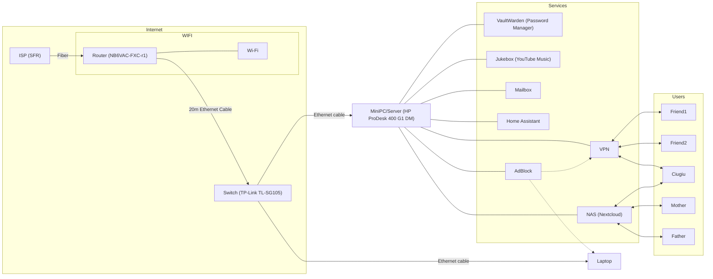

# Home-Lab  
Documentation of my home lab setup.  

## Visualisation  

```mermaid  
flowchart LR
    
    subgraph Internet["Internet"]
	    subgraph WIFI["WIFI"]
        Router["Router (NB6VAC-FXC-r1)"]
        Wi-Fi["Wi-Fi"]
	    end
        ISP["ISP (SFR)"]
        Switch["Switch (TP-Link TL-SG105)"]
    end
    subgraph Server["Services"]
        Vault["VaultWarden (Password Manager)"]
        Jukebox["Jukebox (YouTube Music)"]
        Mailbox["Mailbox"]
        NAS["NAS (Nextcloud)"]
        HomeAssistant["Home Assistant"]
        AdBlock["AdBlock"]
        VPN["VPN"]
    end
    subgraph Users["Users"]
        RuFriend1["Friend1"]
        RuFriend2["Friend2"]
        Ciugiu["Ciugiu"]
        Mother["Mother"]
        Father["Father"]
    end
    ISP -- Fiber --> Router
    MiniPC["MiniPC/Server (HP ProDesk 400 G1 DM)"] --- Vault
    MiniPC --- Jukebox
    MiniPC --- Mailbox
    MiniPC --- NAS
    MiniPC --- HomeAssistant
    MiniPC --- AdBlock
    MiniPC --- VPN
    Router -- 20m Ethernet Cable --> Switch
    Router --- Wi-Fi
    Switch -- Ethernet cable --> Laptop["Laptop"]
    Switch -- Ethernet cable --> MiniPC
    VPN <-->  RuFriend1 & RuFriend2 & Ciugiu
    NAS <--> Father & Mother
    NAS <--> Ciugiu:::no-cross
    AdBlock -.-> VPN & Laptop
```
